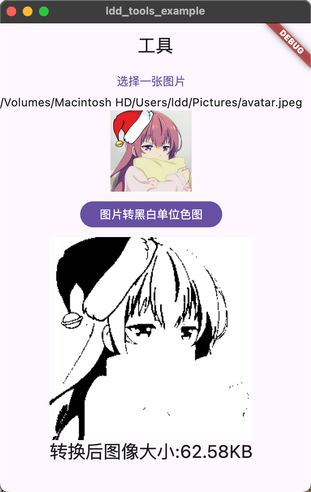

# ldd_tools

Convert an image into an image that the printer can recognize

## Getting Started


add to your pubspec.yaml
```yaml
  ldd_tools: any
```


## init

`initLddToolLib()` add your main function

```dart
void main() {
  initLddToolLib(); // add this line
  runApp(const MyApp());
}
```


## Image thresholding

Convert images into image types that the printer can recognize

```dart
  Future<void> covertToImage(File file) async {
    try {
      final bfs = await file!.readAsBytes();
      bitmapImage = await lddCoverImageToLuma8(
          imageBuffer: bfs,
          thresholdValue: 128,
          width: 150,
          height: 150,
          thresholdType: LddThresholdType.binary,
          imageFormat: LddImageFormat.bmp);
      print(
          "cover result :${bitmapImage!.bitmap.length} ${bitmapImage!.width} ${bitmapImage!.height}");
      setState(() {});
    } catch (e) {
      print("err $e");
    }
  }
```

example




full example

```dart
import 'dart:io';
import 'dart:typed_data';

import 'package:dd_js_util/dd_js_util.dart';
import 'package:dd_js_util/model/models.dart';
import 'package:file_picker/file_picker.dart';
import 'package:flutter/material.dart';
import 'package:ldd_tools/api/image.dart';
import 'package:ldd_tools/api/printer.dart';
import 'package:ldd_tools/api/tspl.dart';
import 'package:ldd_tools/ldd_tools.dart';

void main() {
  initLddToolLib();
  runApp(const MyApp());
}

class MyApp extends StatefulWidget {
  const MyApp({super.key});

  @override
  State<MyApp> createState() => _MyAppState();
}

class _MyAppState extends State<MyApp> {
  File? file;
  BitmapImage? bitmapImage;

  Future<void> selectFile() async {
    FilePickerResult? result = await FilePicker.platform.pickFiles();
    if (result != null) {
      file = File(result.files.single.path!);
      setState(() {});
    } else {
      // User canceled the picker
    }
  }

  ///转换图片
  Future<void> covertToImage(File file) async {
    try {
      final build = TsplCommandBuild();
      build.size(size: (50, 50));
      build.density(n: 3);
      build.speed(n: 2);
      build.shift(y: 0);
      build.offset(m: 0);
      build.gap(m: 3, n: 0);
      build.codePage(n: "UTF-8");
      build.cls();

      final bfs = await file.readAsBytes();
      bitmapImage = await lddCoverImageToLuma8(
          imageBuffer: bfs,
          thresholdValue: 128,
          width: 50,
          height: 50,
          thresholdType: LddThresholdType.binary,
          imageFormat: LddImageFormat.bmp);
      await build.appendBmpImage(image: bitmapImage!, pos: (0, 0));
      build.printer(count: (0, 0));
      final finalData = build.build();
      print("data: ${finalData.toList()}");
      setState(() {});
    } catch (e) {
      print("err $e");
    }
  }

  @override
  Widget build(BuildContext context) {
    return MaterialApp(
      home: Scaffold(
        appBar: AppBar(
          title: const Text('工具'),
        ),
        body: SingleChildScrollView(
          child: Column(
            children: [
              TextButton(onPressed: selectFile, child: const Text("选择一张图片")),
              if (file != null) Text(file!.path),
              if (file != null)
                SizedBox(
                  width: 100,
                  height: 100,
                  child: Image.file(file!),
                ),
              const SizedBox(height: 12),
              FilledButton(
                  onPressed: file == null ? null : () => covertToImage(file!),
                  child: const Text("图片转黑白单位色图")),
              const SizedBox(height: 12),
              if (bitmapImage != null)
                Image.memory(
                  bitmapImage!.bitmap,
                  width: bitmapImage!.width.toDouble(),
                  height: bitmapImage!.height.toDouble(),
                ),
              if (bitmapImage != null)
                Text(
                  "转换后图像大小:${ByteModel.create(bitmapImage!.bitmap.length.toDouble()).format(2)}",
                  style: context.textTheme.titleLarge,
                )
            ],
          ),
        ),
      ),
    );
  }
}

```


## 相关文档

- [TSPL文档](http://xmxyt.tech/uploadfile/ueditor/file/202112/16384539210f9796.pdf)
- [大佬的博客](https://tricked.dev/blog/printing-images-tspl-rust/)